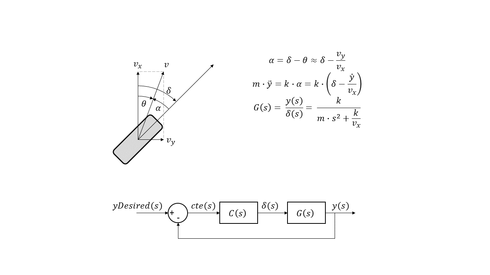
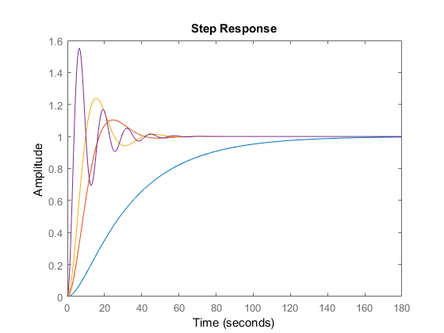
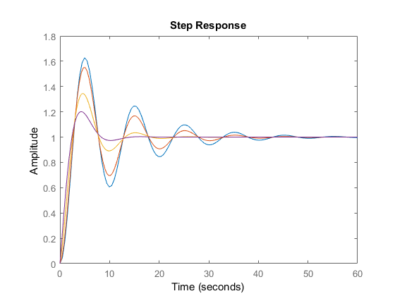

# CarND-Controls-PID
Self-Driving Car Engineer Nanodegree Program

---

## Dependencies

* cmake >= 3.5
 * All OSes: [click here for installation instructions](https://cmake.org/install/)
* make >= 4.1
  * Linux: make is installed by default on most Linux distros
  * Mac: [install Xcode command line tools to get make](https://developer.apple.com/xcode/features/)
  * Windows: [Click here for installation instructions](http://gnuwin32.sourceforge.net/packages/make.htm)
* gcc/g++ >= 5.4
  * Linux: gcc / g++ is installed by default on most Linux distros
  * Mac: same deal as make - [install Xcode command line tools]((https://developer.apple.com/xcode/features/)
  * Windows: recommend using [MinGW](http://www.mingw.org/)
* [uWebSockets](https://github.com/uWebSockets/uWebSockets) == 0.13, but the master branch will probably work just fine
  * Follow the instructions in the [uWebSockets README](https://github.com/uWebSockets/uWebSockets/blob/master/README.md) to get setup for your platform. You can download the zip of the appropriate version from the [releases page](https://github.com/uWebSockets/uWebSockets/releases). Here's a link to the [v0.13 zip](https://github.com/uWebSockets/uWebSockets/archive/v0.13.0.zip).
  * If you run OSX and have homebrew installed you can just run the ./install-mac.sh script to install this
* Simulator. You can download these from the [project intro page](https://github.com/udacity/CarND-PID-Control-Project/releases) in the classroom.

## Basic Build Instructions

1. Clone this repo.
2. Make a build directory: `mkdir build && cd build`
3. Compile: `cmake .. && make`
4. Run it: `./pid`. 

## Controller Design

The control of the vehicle is realized via two seperate control loops:
1) closed loop lateral position control
2) closed loop speed control.

### Closed-loop Lateral Control

For lateral control, the controller minimizes the cross tracking error which represents the vehicle's lateral deviation from the desired trajectory. This quantity is provided by the vehicle simulator. The controller is implemented as a PID controller where the derivative and integral error quantatites are calculated by the controller. The P, I and D gains are all tuned using a manual approach making use of an understanding of the underlying vehicle dyanmics and control theory. 

By treating the vehicle as a simple point mass and linearizing the equations of motion around straight line driving and constant sped the following plant model transfer function is derived in the s-domain:

Where `delta` represents steering input and `y` represents lateral displacement.

Using the derived plant model, the effects of the PID gains for closed loop control of cross tracking error can be analyzed to provide direction for tuning the gains in the simulator. Note that, while we don't know the critical parameters of the vehicle (e.g. tyre stiffness or vehicle mass) that we intend on controlling in the simulator, we can use the simple model to give a general idea of what each parameter does. 

As seen on the P-gain sweep plot below, the proportional gain can be used to control the response speed of the controller. If the gain is too low, the time constant for the response of the system is very long and the system over-damped. If the gain are very high system responds very quickly but at the expense of a very under-damped response.

The D-gain sweep below highlights the effectiveness of the derivative gain in maintaining a similar response time while significantly improving the damping of the response. It seems like a good strategy for tuning the controller gains might be to first choose an approriate P-gain that dials in the desired steering response, followed by tuning the D-gain to improve the damping characteristics of the system. In actuality, calculating the derivative of the CTE error introduces significant noise in the system and and overlying on the D-gain can introduce high-frequency noise into the steering control signal; in this case applying a low-pass filter might be useful.

In the case of this simple vehicle analysis, the I-gain does not add any benefit but in reality it is expected that this gain is able to minimize the steady-state error of the controller. Note, that a sufficiently large value will introduce instability in the system so it seems best to leave the tuning of this parameter to the latter stages of parameter tuning to address any apparent steady state tracking error.

### Closed-loop Speed Control

The longitudinal speed control consists of a PI controller which minimizes the error between the desired and oberved vehicle speed. The P and I gains are tuned using a similar approach as the lateral one. The desired speed is fixed for the entire lap and the control is implemented as a lower-bandwidth controller as compared to the latearl control. In essence, the speed control is a secondary controller which we are less interested in being as accurate as the steering controller. A natural improvement would be to introduced sliding gains in the lateral controller which are dependent on vehicle speed since the steering sensitivity varies with vehicle speed.